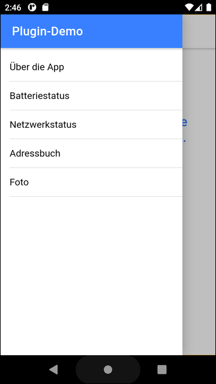
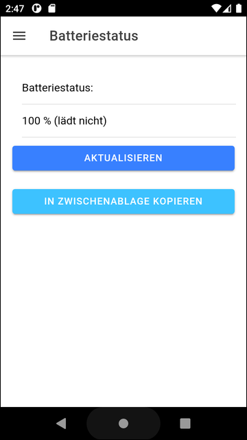
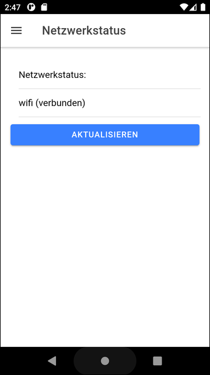
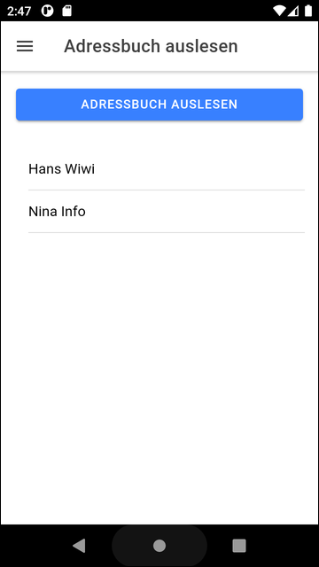
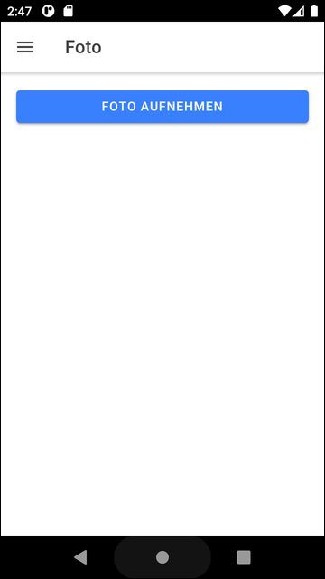

# Ionic-App "Plugin-Demo" #

 

Diese Repository enthält ein [Ionic](https://ionicframework.com/)/Angular-Projekt für eine mobile App,
mit der mehrere [Plugins](https://capacitorjs.com/docs/plugins) für [Capacitor](https://capacitorjs.com/)
demonstriert werden

 

----

## Screenhots ##

 

  &nbsp;  

 

  &nbsp;  

 

  &nbsp;  

 

----

## License ##

 

See the [LICENSE file](LICENSE.md) for license rights and limitations (BSD 3-Clause License) for the files in this repository.

 