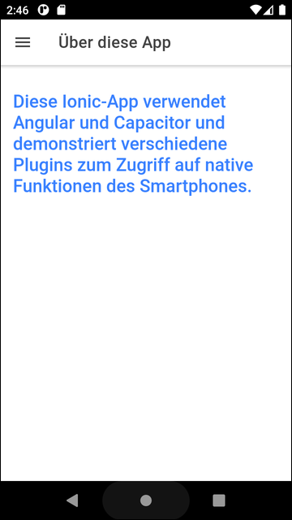

# Ionic-App "Plugin-Demo" #

Simple [Ionic](https://ionicframework.com) app with [Capacitor](https://capacitorjs.com/) to demonstrate usage of [plugins](https://capacitorjs.com/docs/plugins).

 

----

## Screenhots ##

  &nbsp;  

 

  &nbsp;  

 

  &nbsp;  

 

----

## License ##

See the [LICENSE file](LICENSE.md) for license rights and limitations (BSD 3-Clause License) for the files in this repository.
